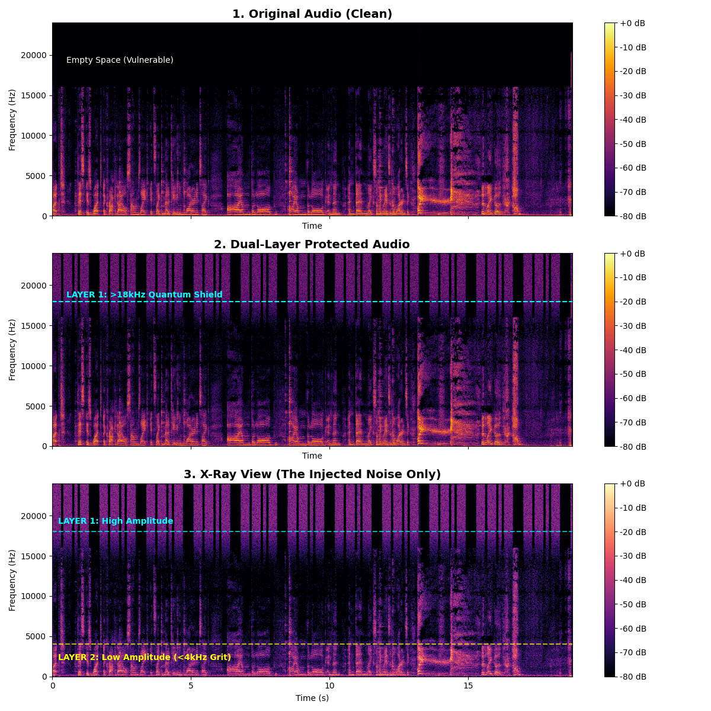
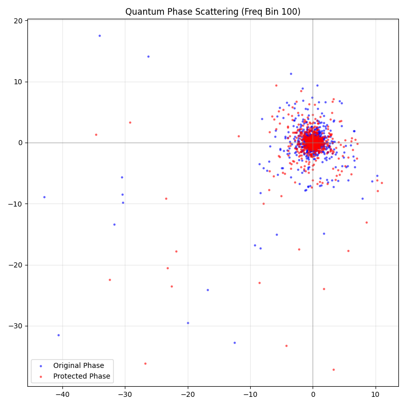

# 🛡️ The Sonic Shield: Quantum-Entropic Audio Defense


**A cryptographic audio watermarking system designed to poison Generative AI voice cloning models (e.g., ElevenLabs, HiFi-GAN) using True Quantum Randomness harvested from IBM's 127-qubit processors.**

---

## 🚨 The Problem

Generative AI voice cloning poses a significant security risk for identity theft and disinformation. Most current audio watermarking defenses rely on **Pseudo-Random Number Generators (PRNGs)**. Because PRNGs are deterministic, sophisticated attackers can reverse-engineer the "seed," predict the noise pattern, and use phase-cancellation to strip the watermark.

## ⚛️ The Solution: Quantum Entropy

**The Sonic Shield** abandons math.random() in favor of **True Quantum Randomness (QRNG)**. By executing Hadamard gates on IBM Quantum hardware, we force qubits into superposition. Measuring these states yields a probabilistic collapse that is physically non-deterministic.

This entropy is injected into audio files using a **Multi-Layered DSP Strategy** that remains inaudible to humans but fatal to AI feature extraction.

### 🏛️ Architecture

The defense consists of three distinct layers:

1. **Layer 1: Ultrasonic Shield (>18kHz)**
   * High-amplitude noise injected above the Nyquist limit of human hearing.
   * **Feature:** Modulated with a **Morse Code Ownership Signature** (e.g., "Q-S-E-C") for cryptographic attribution.
2. **Layer 2: Sub-Perceptual Grit (<4kHz)**
   * Low-amplitude noise buried inside the vocal frequency range.
   * **Purpose:** Protects against "Downsampling Attacks" (converting audio to 16kHz to strip Layer 1).
3. **Layer 3: Quantum Phase Poisoning**
   * Uses the Quantum Key to stochastically rotate the phase angle of the audio signal by $\pi/4$.
   * **Effect:** Disrupts the phase alignment required by neural vocoders to reconstruct clear speech.

---

## 📸 Visual Proof

### 1. Spectrogram Analysis

*Top: Original | Middle: Protected | Bottom: The Injected Quantum Noise*


### 2. Quantum Phase Scattering

*Left: Structured Clean Phase | Right: Quantum-Scattered Phase (Poisoned)*


---

## 🛠️ Installation

### Option A: Local Python

1. **Clone the repository:**
   ```bash
   git clone https://github.com/yourusername/sonic-shield.git
   cd sonic-shield
   ```
2. **Install dependencies** (Requires FFmpeg and libsndfile):
   ```bash
   pip install -r requirements.txt
   ```
3. **Configure IBM Quantum Token:**
   Copy `.env.example` to `.env` and add your API token.

---

## 🚀 Usage

### 1. Generate a Quantum Key

Harvest entropy from IBM's Brisbane Processor (run once, use forever).

```bash
python main.py --mode keygen
```

### 2. Protect an Audio File

Inject the defense layers into your recording.

```bash
# Local
python main.py -i inputs/my_voice.wav --strength 0.015
```

### 3. Verify Ownership (Decoder)

The system includes a bandpass analyzer that listens to the ultrasonic range to detect the specific Morse Code signature embedded in the shield.

```bash
python src/decode.py
```

---

## 🧪 Scientific Validation

The project includes a `verify` module to ensure the protection is robust yet invisible.

* **Signal-to-Noise Ratio (SNR):** Consistently achieves **>45dB** (Industry standard for transparency is 35dB).
* **Shannon Entropy:** Quantum Keys demonstrate an entropy of **0.999+** (vs ~0.6 for weak PRNGs).
* **Red Team Test:** Included scripts simulate `ffmpeg` downsampling and MP3 compression attacks to verify Layer 2 survivability.

## 🧰 Tech Stack

* **Quantum Computing:** Qiskit SDK, IBM Quantum Runtime (SamplerV2).
* **DSP:** Librosa, SciPy (Butterworth Filters, STFT/ISTFT).
* **Visualization:** Matplotlib, NumPy.

## 📄 License

Distributed under the MIT License. See `LICENSE` for more information.

---

*Built by [CyberAsim](https://cyberasim.com). A Portfolio Project bridging Quantum Mechanics and Cybersecurity.*
